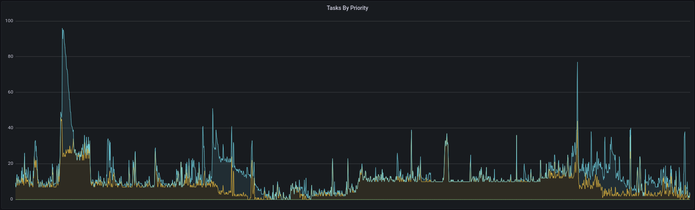
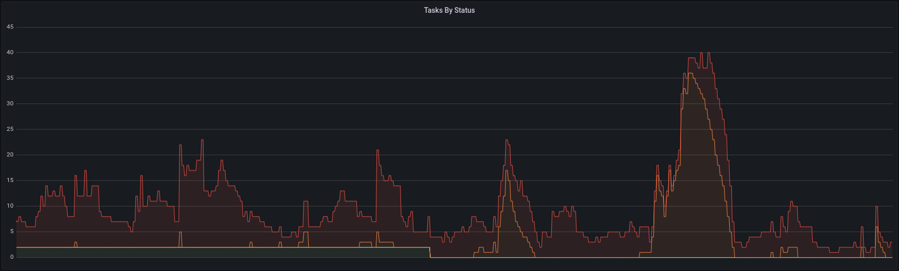
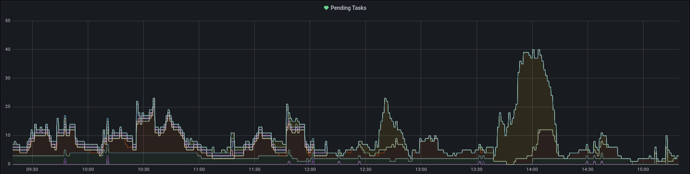

# Karton Dashboard


A small Flask application for Karton task and queue introspection.

## Usage

First of all, make sure you have setup the core system: https://github.com/CERT-Polska/karton

Then install karton-dashboard from PyPi:

```shell
$ pip install karton-dashboard

$ karton-dashboard run -h 127.0.0.1 -p 5000
```

The `karton-dashboard` is just a wrapper on the `flask` program, and it works with any arguments accepted by flask. For example `karton-dashboard --help`, or `karton-dashboard run -h 0.0.0.0 -p 1234`. See [flask documentation](https://flask.palletsprojects.com/en/1.1.x/cli/) for more information.

# Xref buttons

If you have other systems that store artifacts related to a specific karton task there's an option to easily link them in the task view.

You'll need to set the `xrefs` options of `dashboard` section in your `karton.ini` configuration file like so:

```ini
[dashboard]
xrefs={"mwdb": "https://mwdb.cert.pl/?q=karton:{root_uid}"}
```

Each link will be rendered as a button in the task view like so:


## Metrics

Karton tracks number of consumed, produced and crashed tasks for each service (identity).

Karton-dashboard exposes this information (in addition to some other task/queue statistics) on the `/varz` endpoint using Prometheus data format.

You can use this data to easily build custom karton dashboards and setup alerts for unusual events or high loads. Just point the data source URL to `https://karton-dashboard/varz` and configure the dashboard however you like.

Here are a few examples of how the data can be digested and presented in a grafana dashboard:

### `sum(karton_tasks{name!=""}) by (priority)`



### `sum(karton_tasks{name!=""}) by (status)`



### `sum(karton_tasks{name!=""}) by (name)`



